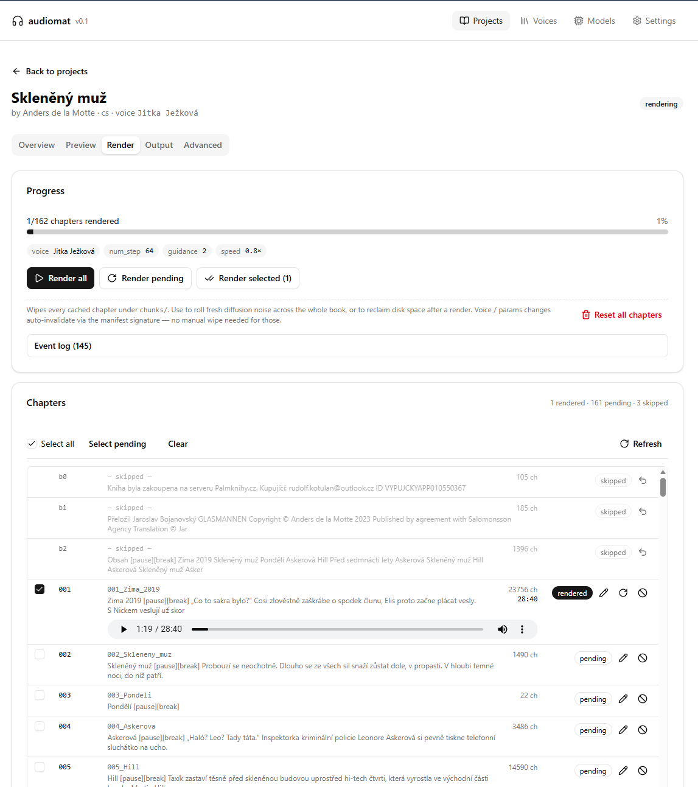

# audiomat

Convert eBooks into audiobooks with cloned voices, locally and offline.

> "Vlož knihu, vypadne audiokniha." — feed in a book, get an audiobook out.

**Status:** alpha — full pipeline working end-to-end, actively used for
personal Czech audiobook conversion. Issues + PRs welcome.



## What audiomat is

A focused, GPU-accelerated audiobook generator built around
[OmniVoice](https://github.com/k2-fsa/OmniVoice) (Apache-2.0). One-stack,
opinionated, optimized for Czech (works for 600+ languages because OmniVoice
does, but Czech narrative quality is the design target).

You give it:

- An EPUB or TXT file
- A 5–10 s WAV of a voice you want to clone, plus its transcript

audiomat produces:

- An M4B audiobook with chapter markers
- Per-chapter WAVs (loudness-normalized to -16 LUFS audiobook standard)
- Resumable per-chunk cache (interrupted run = restart picks up where it left off)

## Why not [pick another tool]

There are several solid open-source audiobook generators (epub2tts,
audiobook_maker, abogen, chatterbox-Audiobook, …). audiomat differs:

- **One TTS engine, not a selector.** OmniVoice fixed. Less surface, fewer bugs.
- **Czech-first.** Section-header pause injection, time-marker handling, 5–10 s
  reference voice clip workflow (OmniVoice native window), pipeline validated
  end-to-end on full Czech audiobook renders.
- **Project-shaped UX.** Named projects (not session UUIDs), shared voice
  library re-usable across books, parameter-sweep preview matrix.
- **Premium defaults.** `num_step=48`, `guidance_scale=2.0` baked in —
  validated via direct A/B against an original human recording.

## Tested alternatives

Before settling on OmniVoice we A/B-tested several TTS engines on the same
Czech reference voice (5–10 s clip, narrator Jitka Ježková). All samples
below render the same Czech excerpt. Ratings are subjective on Czech
narrative content; speed is end-to-end on a single RTX 5070 (12 GB).

<table>
<thead>
<tr>
<th>Engine</th>
<th>Provider</th>
<th>Cost</th>
<th>License</th>
<th>Speed</th>
<th>Quality (CZ)</th>
<th>Sample</th>
</tr>
</thead>
<tbody>

<tr>
<td><strong>OmniVoice</strong> ⭐ <em>winner</em></td>
<td><a href="https://github.com/k2-fsa/OmniVoice">k2-fsa/OmniVoice</a></td>
<td>Free</td>
<td>Apache-2.0</td>
<td>★★★★☆</td>
<td>★★★★☆</td>
<td><a href="samples/sample%20-%20omnivoice.wav">▶ WAV (25 MB)</a></td>
</tr>

<tr>
<td>Fish Speech S2-Pro</td>
<td><a href="https://github.com/fishaudio/fish-speech">fishaudio</a> (model) + <a href="https://huggingface.co/mach9243/s2-pro-gguf">mach9243</a> (Q8_0 GGUF) via <code>s2.cpp</code> (Vulkan)</td>
<td>Free <em>(non-commercial)</em></td>
<td>Fish Audio Research License</td>
<td>★☆☆☆☆</td>
<td>★★★★☆</td>
<td><a href="samples/sample%20-%20s2pro.wav">▶ WAV (16 MB)</a></td>
</tr>

<tr>
<td>Chatterbox-CZ</td>
<td><a href="https://github.com/resemble-ai/chatterbox">Resemble AI</a> + <a href="https://huggingface.co/Thomcles/Chatterbox-TTS-Czech">Thomcles CZ fine-tune</a></td>
<td>Free</td>
<td>MIT + CC0</td>
<td>★★★★☆</td>
<td>★★★★☆</td>
<td><a href="samples/sample%20-%20chatterbox.wav">▶ WAV (3 MB)</a></td>
</tr>

<tr>
<td>XTTS v2</td>
<td><a href="https://huggingface.co/coqui/XTTS-v2">coqui/XTTS-v2</a></td>
<td>Free <em>(non-commercial)</em></td>
<td>CPML</td>
<td>★★★☆☆</td>
<td>★★☆☆☆</td>
<td><a href="samples/sample%20-%20xtts2.wav">▶ WAV (21 MB)</a></td>
</tr>

<tr>
<td>TopMediai (cloud)</td>
<td><a href="https://www.topmediai.com/">topmediai.com</a></td>
<td><strong>Paid</strong></td>
<td>Commercial SaaS</td>
<td>★★★★★</td>
<td>★★★★★</td>
<td><a href="samples/sample%20-%20topmediai.wav">▶ WAV (18 MB)</a></td>
</tr>

</tbody>
</table>

TopMediai is the highest-quality option overall but it's a paid cloud
service — out of scope for a local, offline-first audiobook tool.
Among the self-hostable engines, OmniVoice and Chatterbox-CZ are roughly
tied on Czech quality; OmniVoice wins on operational simplicity (single
in-process model, no server lifecycle, no fine-tune dependency) and on
multilingual reach (600+ languages out of the box). Fish Speech S2-Pro
shipped the predecessor production cut (`Skleneny_muz_s2.m4b`, 13:46:33)
but its `s2.cpp` Vulkan server has VRAM degradation that needed a
render-loop restart wrapper, and the F16 weights OOMed on 12 GB VRAM
(`s2-pro-q8_0-transformer-only.gguf` 5.0 GB + `s2-pro-q8_0-codec-only.gguf`
976 MB was the only viable quantization).

## Install

The supported install path is Docker (multi-stage image bundles backend +
frontend). Local Python is fine for development.

### Docker (recommended)

```bash
git clone https://github.com/rkotulan/audiomat.git
cd audiomat
docker compose up --build
# open http://localhost:7860
```

The compose file mounts a named volume at `/data` for voices, projects,
and the OmniVoice model cache (~3 GB, downloaded on first render).

NVIDIA GPU + recent driver required (CUDA 12.8 wheels in the image).

### Manual Docker

```bash
docker run --gpus all \
    -p 7860:7860 \
    -v audiomat-data:/data \
    -e AUDIOMAT_LIBRARY_ROOT=/data \
    kotulan/audiomat:latest
```

## Development setup

Backend (Python ≥ 3.11, NVIDIA GPU + CUDA 12.x):

```bash
cd audiomat/
python -m venv .venv
. .venv/bin/activate         # or .venv\Scripts\activate on Windows
pip install -r requirements.txt
```

Frontend (Node ≥ 20):

```bash
cd frontend/
npm install
npm run dev      # Vite on http://localhost:5173, proxies /api → :8000
```

Optional Claude Code design skill (recommended if you use Claude Code):

```bash
npm install -g uipro-cli
uipro init --ai claude     # installs ui-ux-pro-max into .claude/skills/
```

The skill is gitignored — install once locally; restart Claude Code to pick
it up.

## License

MIT — see [LICENSE](LICENSE).

OmniVoice model checkpoint is pulled at runtime from
[k2-fsa/OmniVoice](https://huggingface.co/k2-fsa/OmniVoice) (Apache-2.0).
audiomat does not redistribute model weights.

## Acknowledgments

- [k2-fsa/OmniVoice](https://github.com/k2-fsa/OmniVoice) — TTS engine
- [DrewThomasson/ebook2audiobook](https://github.com/DrewThomasson/ebook2audiobook)
  — UX inspiration for the Gradio flow
- Cyprien Oucortex (Chatterbox-TTS-Czech, YodaLingua-Czech) — Czech TTS
  evaluation guidance
